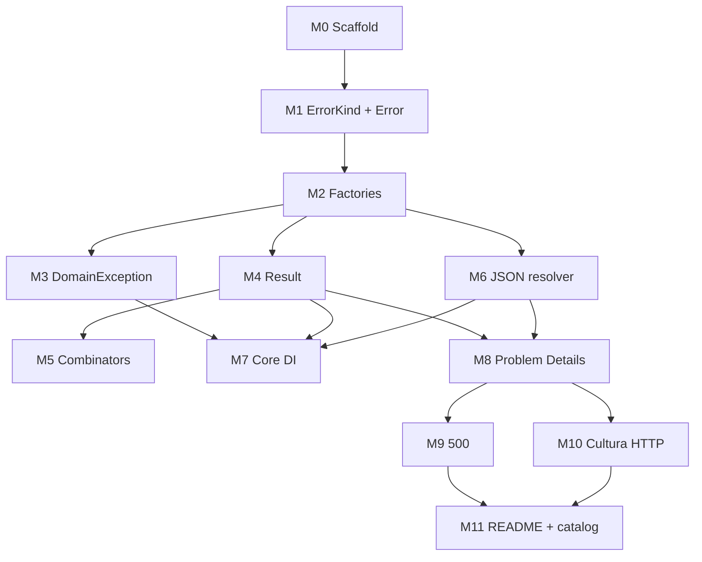

# Offside Implementation Plan

> **For agentic workers:** REQUIRED SUB-SKILL: Use superpowers:subagent-driven-development (recommended) or superpowers:executing-plans to implement this plan task-by-task. Steps use checkbox (`- [ ]`) syntax for tracking.

**Goal:** Entregar os pacotes NuGet `Offside` e `Offside.AspNetCore` conforme `docs/superpowers/specs/2026-08-12-domain-errors-design.md`.

**Architecture:** Core (`netstandard2.0;net8.0;net10.0`) expõe `Error`, `Result`/`Result<T>` e o resolvedor JSON. AspNetCore (`net8.0;net10.0`) só traduz `Result` em Problem Details. O domínio nunca referencia HTTP.

**Tech Stack:** SDK-style csproj, xUnit, `System.Text.Json`, `Microsoft.Extensions.DependencyInjection.Abstractions`, `Microsoft.AspNetCore.App` (só no pacote AspNetCore), `Microsoft.AspNetCore.Mvc.Testing` nos testes HTTP.

**Spec:** `docs/superpowers/specs/2026-08-12-domain-errors-design.md`

---

## TDD (obrigatório em todo o código de produção)

```
NO PRODUCTION CODE WITHOUT A FAILING TEST FIRST
```

Cada fatia: **RED** (um teste de comportamento) → correr e ver falhar pela razão certa → **GREEN** (mínimo) → correr e ver passar → commit só no fim do milestone.

Excepções (sem teste primeiro): `.csproj`, `Directory.Build.props`, `.sln`, `errors.json` default, README. Exploração throwaway apaga-se; implementação nasce dos testes.

**Seams (só estes):**

| Seam | O que o teste observa |
|---|---|
| `Error` factories | `Code`, `Kind`, `Arguments`, `Field` |
| `Error` igualdade / `Code` vazio | igualdade e throw |
| `Error.ToException()` | tipo `DomainException`, `Code`, `Errors` |
| `Result` / `Result<T>` | `IsSuccess`, `Errors`, `TryGetValue`, `Value` em falha, `Failure()` vazio |
| `Map` / `Bind` / `Match` / `Combine` | short-circuit vs junção de erros |
| `IErrorMessageResolver.GetMessage` | fallback de cultura, chave em falta, interpolação |
| `ToHttpResult` / `IActionResult` | status, `application/problem+json`, `errors[]`, `traceId`, 500 sanitizado, `debug` |
| `AddOffside` | resolvedor no DI; default JSON em falta → throw no startup |

Não testar métodos privados, interpolador interno, nem mapeamento HTTP via reflexão.

**Runner:** `dotnet test` na solução. Um teste de cada vez no RED/GREEN (`dotnet test --filter FullyQualifiedName~NomeDoTeste`).

---

## Paralelismo

Não paralelizar fatias que partilham o mesmo tipo em construção. Depois de um milestone estar committed, os ramos seguintes podem ser worktrees/subagentes isolados e merge na ordem do grafo.



| Onda | Milestones | Condição |
|---|---|---|
| 1 | M0 | sozinho |
| 2 | M1 → M2 | sequencial no Core |
| 3 | **M3, M4, M6 em paralelo** | depois de M2 committed |
| 4 | M5 | depois de M4 (não paralelo com M4) |
| 5 | M7 | depois de M3+M4+M6 |
| 6 | M8 | depois de M4+M6 (pode sobrepor-se a M7 se DI AspNetCore for local) |
| 7 | **M9 e M10 em paralelo** | depois de M8 |
| 8 | M11 | depois de M9+M10 |

M7 e M8: M8 pode usar `new JsonErrorMessageResolver(...)` nos testes sem DI. M7 e M8 **podem** correr em paralelo depois de M4+M6. M8 não edita `OffsideServiceCollectionExtensions.cs` do Core; M7 não edita ficheiros AspNetCore.

Cada subagente paralelo: um milestone, só os ficheiros desse milestone, TDD, um commit, não rebase no trabalho do outro.

---

## Mapa de ficheiros

```text
Offside.sln
Directory.Build.props
src/Offside/Offside.csproj
src/Offside/ErrorKind.cs
src/Offside/Error.cs
src/Offside/ErrorArgumentConverter.cs
src/Offside/DomainException.cs
src/Offside/Result.cs
src/Offside/ResultT.cs
src/Offside/IErrorMessageResolver.cs
src/Offside/JsonErrorMessageResolver.cs
src/Offside/OffsideOptions.cs
src/Offside/OffsideServiceCollectionExtensions.cs
src/Offside/errors.json
src/Offside.AspNetCore/Offside.AspNetCore.csproj
src/Offside.AspNetCore/ErrorSeverity.cs
src/Offside.AspNetCore/OffsideProblem.cs
src/Offside.AspNetCore/ResultHttpExtensions.cs
src/Offside.AspNetCore/OffsideAspNetCoreOptions.cs
src/Offside.AspNetCore/OffsideServiceCollectionExtensions.cs
tests/Offside.Tests/Offside.Tests.csproj
tests/Offside.Tests/ErrorConstructionTests.cs
tests/Offside.Tests/ErrorFactoryTests.cs
tests/Offside.Tests/DomainExceptionTests.cs
tests/Offside.Tests/ResultTests.cs
tests/Offside.Tests/ResultCombinatorTests.cs
tests/Offside.Tests/JsonErrorMessageResolverTests.cs
tests/Offside.Tests/OffsideServiceCollectionExtensionsTests.cs
tests/Offside.AspNetCore.Tests/Offside.AspNetCore.Tests.csproj
tests/Offside.AspNetCore.Tests/ProblemDetailsTests.cs
tests/Offside.AspNetCore.Tests/Sanitized500Tests.cs
tests/Offside.AspNetCore.Tests/RequestCultureTests.cs
```

---

## Milestone M0 — Scaffold

**Commit:** `chore: scaffold Offside solution`

**Files:**
- Create: `Directory.Build.props`, `Offside.sln`, os quatro `.csproj`
- Rename: pasta `DomainErrors` → `Offside` (manter `docs/`)

- [ ] **Step 1: Directory.Build.props e projectos**

`Directory.Build.props`:

```xml
<Project>
  <PropertyGroup>
    <LangVersion>latest</LangVersion>
    <Nullable>enable</Nullable>
    <ImplicitUsings>enable</ImplicitUsings>
    <TreatWarningsAsErrors>true</TreatWarningsAsErrors>
    <Authors>Offside</Authors>
    <RepositoryUrl>https://github.com/vpcam/Offside</RepositoryUrl>
  </PropertyGroup>
</Project>
```

`src/Offside/Offside.csproj`:

```xml
<Project Sdk="Microsoft.NET.Sdk">
  <PropertyGroup>
    <TargetFrameworks>netstandard2.0;net8.0;net10.0</TargetFrameworks>
    <RootNamespace>Offside</RootNamespace>
    <AssemblyName>Offside</AssemblyName>
    <PackageId>Offside</PackageId>
    <Description>Domain errors as Result, not exceptions. The domain called offside.</Description>
    <IsPackable>true</IsPackable>
  </PropertyGroup>
  <ItemGroup>
    <PackageReference Include="System.Text.Json" Version="8.0.5" />
    <PackageReference Include="Microsoft.Extensions.DependencyInjection.Abstractions" Version="8.0.2" />
  </ItemGroup>
</Project>
```

`src/Offside.AspNetCore/Offside.AspNetCore.csproj`:

```xml
<Project Sdk="Microsoft.NET.Sdk">
  <PropertyGroup>
    <TargetFrameworks>net8.0;net10.0</TargetFrameworks>
    <RootNamespace>Offside.AspNetCore</RootNamespace>
    <PackageId>Offside.AspNetCore</PackageId>
    <IsPackable>true</IsPackable>
  </PropertyGroup>
  <ItemGroup>
    <FrameworkReference Include="Microsoft.AspNetCore.App" />
    <ProjectReference Include="..\Offside\Offside.csproj" />
  </ItemGroup>
</Project>
```

`tests/Offside.Tests/Offside.Tests.csproj`:

```xml
<Project Sdk="Microsoft.NET.Sdk">
  <PropertyGroup>
    <TargetFrameworks>net8.0;net10.0</TargetFrameworks>
    <IsPackable>false</IsPackable>
  </PropertyGroup>
  <ItemGroup>
    <PackageReference Include="Microsoft.NET.Test.Sdk" Version="17.12.0" />
    <PackageReference Include="xunit" Version="2.9.3" />
    <PackageReference Include="xunit.runner.visualstudio" Version="3.0.2" />
    <PackageReference Include="Microsoft.Extensions.DependencyInjection" Version="8.0.1" />
    <ProjectReference Include="..\..\src\Offside\Offside.csproj" />
  </ItemGroup>
</Project>
```

`tests/Offside.AspNetCore.Tests/Offside.AspNetCore.Tests.csproj`: igual ao de testes Core, mais:

```xml
<PackageReference Include="Microsoft.AspNetCore.Mvc.Testing" Version="8.0.11" />
<ProjectReference Include="..\..\src\Offside.AspNetCore\Offside.AspNetCore.csproj" />
```

No TFM `net10.0` dos testes AspNetCore, usar `Microsoft.AspNetCore.Mvc.Testing` 10.x se o restore do 8.x falhar nesse TFM — um `ItemGroup` com `Condition="'$(TargetFramework)' == 'net10.0'"`.

- [ ] **Step 2: Criar a solução e verificar restore**

```bash
dotnet new sln -n Offside
dotnet sln Offside.sln add src/Offside/Offside.csproj src/Offside.AspNetCore/Offside.AspNetCore.csproj tests/Offside.Tests/Offside.Tests.csproj tests/Offside.AspNetCore.Tests/Offside.AspNetCore.Tests.csproj
dotnet restore Offside.sln
dotnet build Offside.sln
```

Expected: BUILD SUCCEEDED. Se a pasta ainda se chamar `DomainErrors`, renomear para `Offside` **antes** do `dotnet new sln` e mover o agente para a nova root.

- [ ] **Step 3: Commit**

```bash
git add Directory.Build.props Offside.sln src tests
git commit -m "chore: scaffold Offside solution"
```

---

## Milestone M1 — ErrorKind + Error

**Commit:** `feat(core): add Error and ErrorKind`

**Files:**
- Create: `src/Offside/ErrorKind.cs`, `src/Offside/Error.cs`, `tests/Offside.Tests/ErrorConstructionTests.cs`

- [ ] **Step 1: RED — Code vazio é ilegal**

```csharp
using Offside;
using Xunit;

namespace Offside.Tests;

public sealed class ErrorConstructionTests
{
    [Fact]
    public void Custom_rejects_empty_code()
    {
        var ex = Assert.Throws<ArgumentException>(() =>
            Error.Custom("  ", ErrorKind.Conflict));

        Assert.Equal("code", ex.ParamName);
    }
}
```

- [ ] **Step 2: Correr o teste e ver falhar**

```bash
dotnet test tests/Offside.Tests --filter FullyQualifiedName~Custom_rejects_empty_code
```

Expected: FAIL — `Error` / `ErrorKind` não existem (CS0103), não um assert falhado.

- [ ] **Step 3: GREEN mínimo**

`ErrorKind.cs` — enum na ordem da spec (não a ordem de severidade HTTP):

```csharp
namespace Offside;

public enum ErrorKind
{
    Unexpected,
    Unauthorized,
    Forbidden,
    TooManyRequests,
    Conflict,
    PreconditionFailed,
    Gone,
    Unprocessable,
    NotFound,
    Validation,
    BadRequest
}
```

`Error.cs` — classe `sealed`, ctor interno, `Custom` valida `code`:

```csharp
namespace Offside;

public sealed class Error : IEquatable<Error>
{
    public string Code { get; }
    public ErrorKind Kind { get; }
    public IReadOnlyDictionary<string, object?> Arguments { get; }
    public string? Field { get; }

    internal Error(
        string code,
        ErrorKind kind,
        IReadOnlyDictionary<string, object?> arguments,
        string? field)
    {
        Code = code;
        Kind = kind;
        Arguments = arguments;
        Field = field;
    }

    public static Error Custom(
        string code,
        ErrorKind kind,
        object? arguments = null,
        string? field = null)
    {
        if (string.IsNullOrWhiteSpace(code))
            throw new ArgumentException("Code must not be empty.", nameof(code));

        return new Error(
            code.Trim(),
            kind,
            ErrorArgumentConverter.ToDictionary(arguments),
            field);
    }

    public bool Equals(Error? other) =>
        other is not null
        && Code == other.Code
        && Kind == other.Kind
        && Field == other.Field
        && ArgumentsEqual(Arguments, other.Arguments);

    public override bool Equals(object? obj) => Equals(obj as Error);

    public override int GetHashCode() => HashCode.Combine(Code, Kind, Field);

    private static bool ArgumentsEqual(
        IReadOnlyDictionary<string, object?> left,
        IReadOnlyDictionary<string, object?> right)
    {
        if (left.Count != right.Count) return false;
        foreach (var pair in left)
        {
            if (!right.TryGetValue(pair.Key, out var value)) return false;
            if (!Equals(pair.Value, value)) return false;
        }
        return true;
    }
}
```

`ErrorArgumentConverter.cs` — nesta fatia pode devolver dicionário vazio se `arguments` for null; conversão de anónimo entra em M2.

`HashCode.Combine` em netstandard2.0: referenciar `Microsoft.Bcl.HashCode` 1.1.1 no `Offside.csproj`.

- [ ] **Step 4: GREEN — o teste passa**

```bash
dotnet test tests/Offside.Tests --filter FullyQualifiedName~Custom_rejects_empty_code
```

Expected: PASS

- [ ] **Step 5: RED — igualdade**

Acrescentar em `ErrorConstructionTests.cs`:

```csharp
[Fact]
public void Errors_with_same_code_kind_field_and_arguments_are_equal()
{
    var left = Error.Custom("order.already_shipped", ErrorKind.Conflict);
    var right = Error.Custom("order.already_shipped", ErrorKind.Conflict);

    Assert.Equal(left, right);
}
```

Correr, ver falhar se `Equals` ainda não estiver completo; implementar o mínimo; passar.

- [ ] **Step 6: Commit**

```bash
git add src/Offside tests/Offside.Tests
git commit -m "feat(core): add Error and ErrorKind"
```

---

## Milestone M2 — Factories

**Commit:** `feat(core): add Error factories`

**Files:**
- Modify: `src/Offside/Error.cs`, `src/Offside/ErrorArgumentConverter.cs`
- Create: `tests/Offside.Tests/ErrorFactoryTests.cs`

- [ ] **Step 1: RED — NotFound**

```csharp
using Offside;
using Xunit;

namespace Offside.Tests;

public sealed class ErrorFactoryTests
{
    [Fact]
    public void NotFound_sets_code_kind_and_arguments()
    {
        var error = Error.NotFound("order", 42);

        Assert.Equal("not_found", error.Code);
        Assert.Equal(ErrorKind.NotFound, error.Kind);
        Assert.Equal("order", error.Arguments["resource"]);
        Assert.Equal(42, error.Arguments["id"]);
        Assert.Null(error.Field);
    }
}
```

```bash
dotnet test tests/Offside.Tests --filter FullyQualifiedName~NotFound_sets_code_kind_and_arguments
```

Expected: FAIL — `NotFound` não existe.

- [ ] **Step 2: GREEN — NotFound**

```csharp
public static Error NotFound(string resource, object? id = null) =>
    new Error(
        "not_found",
        ErrorKind.NotFound,
        ErrorArgumentConverter.ToDictionary(new { resource, id }),
        field: null);
```

- [ ] **Step 3: RED — Custom com anónimo**

```csharp
[Fact]
public void Custom_accepts_anonymous_arguments()
{
    var orderId = "abc";
    var error = Error.Custom(
        "order.already_shipped",
        ErrorKind.Conflict,
        new { orderId });

    Assert.Equal("order.already_shipped", error.Code);
    Assert.Equal(ErrorKind.Conflict, error.Kind);
    Assert.Equal("abc", error.Arguments["orderId"]);
}
```

Expected: FAIL — anónimo não vira dicionário.

- [ ] **Step 4: GREEN — converter**

```csharp
namespace Offside;

internal static class ErrorArgumentConverter
{
    public static IReadOnlyDictionary<string, object?> ToDictionary(object? arguments)
    {
        if (arguments is null)
            return new Dictionary<string, object?>();

        if (arguments is IReadOnlyDictionary<string, object?> readOnly)
            return readOnly;

        if (arguments is IDictionary<string, object?> dictionary)
            return new Dictionary<string, object?>(dictionary);

        var result = new Dictionary<string, object?>(StringComparer.Ordinal);
        foreach (var property in arguments.GetType().GetProperties())
        {
            if (property.GetIndexParameters().Length > 0) continue;
            result[property.Name] = property.GetValue(arguments);
        }

        return result;
    }
}
```

- [ ] **Step 5: RED — tabela das factories restantes (um Theory, uma fatia)**

```csharp
[Theory]
[InlineData(nameof(ErrorKind.Gone), "gone", ErrorKind.Gone)]
[InlineData(nameof(ErrorKind.Conflict), "conflict", ErrorKind.Conflict)]
[InlineData(nameof(ErrorKind.BadRequest), "bad_request", ErrorKind.BadRequest)]
[InlineData(nameof(ErrorKind.Unauthorized), "unauthorized", ErrorKind.Unauthorized)]
[InlineData(nameof(ErrorKind.Forbidden), "forbidden", ErrorKind.Forbidden)]
[InlineData(nameof(ErrorKind.PreconditionFailed), "precondition_failed", ErrorKind.PreconditionFailed)]
[InlineData(nameof(ErrorKind.Unprocessable), "unprocessable", ErrorKind.Unprocessable)]
[InlineData(nameof(ErrorKind.TooManyRequests), "too_many_requests", ErrorKind.TooManyRequests)]
[InlineData(nameof(ErrorKind.Unexpected), "unexpected", ErrorKind.Unexpected)]
public void Built_in_factory_sets_default_code_and_kind(
    string factory,
    string code,
    ErrorKind kind)
{
    var error = factory switch
    {
        nameof(ErrorKind.Gone) => Error.Gone("order", 1),
        nameof(ErrorKind.Conflict) => Error.Conflict("order", "duplicate"),
        nameof(ErrorKind.BadRequest) => Error.BadRequest("malformed"),
        nameof(ErrorKind.Unauthorized) => Error.Unauthorized("token"),
        nameof(ErrorKind.Forbidden) => Error.Forbidden("role"),
        nameof(ErrorKind.PreconditionFailed) => Error.PreconditionFailed("etag"),
        nameof(ErrorKind.Unprocessable) => Error.Unprocessable("state"),
        nameof(ErrorKind.TooManyRequests) => Error.TooManyRequests("limit"),
        nameof(ErrorKind.Unexpected) => Error.Unexpected("boom"),
        _ => throw new ArgumentOutOfRangeException(nameof(factory))
    };

    Assert.Equal(code, error.Code);
    Assert.Equal(kind, error.Kind);
}

[Fact]
public void Validation_uses_field_and_optional_code()
{
    var error = Error.Validation("email", "email.taken", "a@b.c");

    Assert.Equal("email.taken", error.Code);
    Assert.Equal(ErrorKind.Validation, error.Kind);
    Assert.Equal("email", error.Field);
    Assert.Equal("email", error.Arguments["field"]);
    Assert.Equal("a@b.c", error.Arguments["attemptedValue"]);
}

[Fact]
public void Validation_without_code_uses_validation()
{
    var error = Error.Validation("email");

    Assert.Equal("validation", error.Code);
    Assert.Equal("email", error.Field);
}
```

- [ ] **Step 6: GREEN — factories**

Assinaturas exactas da spec:

```csharp
public static Error Gone(string resource, object? id = null) =>
    Create("gone", ErrorKind.Gone, new { resource, id });

public static Error Conflict(string resource, string? reason = null) =>
    Create("conflict", ErrorKind.Conflict, new { resource, reason });

public static Error Validation(string field, string? code = null, object? attemptedValue = null) =>
    new Error(
        string.IsNullOrWhiteSpace(code) ? "validation" : code.Trim(),
        ErrorKind.Validation,
        ErrorArgumentConverter.ToDictionary(new { field, attemptedValue }),
        field);

public static Error BadRequest(string? reason = null) =>
    Create("bad_request", ErrorKind.BadRequest, new { reason });

public static Error Unauthorized(string? reason = null) =>
    Create("unauthorized", ErrorKind.Unauthorized, new { reason });

public static Error Forbidden(string? reason = null) =>
    Create("forbidden", ErrorKind.Forbidden, new { reason });

public static Error PreconditionFailed(string? reason = null) =>
    Create("precondition_failed", ErrorKind.PreconditionFailed, new { reason });

public static Error Unprocessable(string? reason = null) =>
    Create("unprocessable", ErrorKind.Unprocessable, new { reason });

public static Error TooManyRequests(string? reason = null) =>
    Create("too_many_requests", ErrorKind.TooManyRequests, new { reason });

public static Error Unexpected(string? detail = null) =>
    Create("unexpected", ErrorKind.Unexpected, new { detail });

private static Error Create(string code, ErrorKind kind, object arguments) =>
    new Error(code, kind, ErrorArgumentConverter.ToDictionary(arguments), field: null);
```

- [ ] **Step 7: Commit**

```bash
git add src/Offside tests/Offside.Tests
git commit -m "feat(core): add Error factories"
```

---

## Milestone M3 — DomainException (paralelo com M4 e M6)

**Commit:** `feat(core): add DomainException escape hatch`

**Files:**
- Create: `src/Offside/DomainException.cs`, `tests/Offside.Tests/DomainExceptionTests.cs`
- Modify: `src/Offside/Error.cs` (`ToException`)

- [ ] **Step 1: RED**

```csharp
using Offside;
using Xunit;

namespace Offside.Tests;

public sealed class DomainExceptionTests
{
    [Fact]
    public void ToException_exposes_code_and_errors()
    {
        var error = Error.NotFound("order", 1);

        var ex = error.ToException();

        Assert.IsType<DomainException>(ex);
        Assert.Equal("not_found", ex.Message);
        Assert.Equal(error, Assert.Single(ex.Errors));
    }
}
```

Expected: FAIL — `ToException` / `DomainException` ausentes.

- [ ] **Step 2: GREEN**

```csharp
namespace Offside;

public sealed class DomainException : Exception
{
    public IReadOnlyList<Error> Errors { get; }

    public DomainException(IReadOnlyList<Error> errors)
        : base(errors[0].Code)
    {
        Errors = errors;
    }
}
```

```csharp
public DomainException ToException() =>
    new DomainException(new[] { this });
```

- [ ] **Step 3: Commit**

```bash
git add src/Offside/DomainException.cs src/Offside/Error.cs tests/Offside.Tests/DomainExceptionTests.cs
git commit -m "feat(core): add DomainException escape hatch"
```

---

## Milestone M4 — Result / Result\<T\> (paralelo com M3 e M6)

**Commit:** `feat(core): add Result and Result<T>`

**Files:**
- Create: `src/Offside/Result.cs`, `src/Offside/ResultT.cs`, `tests/Offside.Tests/ResultTests.cs`

- [ ] **Step 1: RED — Failure vazio é ilegal**

```csharp
using Offside;
using Xunit;

namespace Offside.Tests;

public sealed class ResultTests
{
    [Fact]
    public void Failure_without_errors_throws()
    {
        Assert.Throws<ArgumentException>(() => Result.Failure());
        Assert.Throws<ArgumentException>(() => Result<int>.Failure());
    }
}
```

Expected: FAIL — tipos ausentes.

- [ ] **Step 2: GREEN mínimo**

`Result.cs`:

```csharp
namespace Offside;

public readonly struct Result
{
    private readonly IReadOnlyList<Error> _errors;
    private readonly bool _isSuccess;

    private Result(bool isSuccess, IReadOnlyList<Error> errors)
    {
        _isSuccess = isSuccess;
        _errors = errors;
    }

    public bool IsSuccess => _isSuccess;
    public bool IsFailure => !_isSuccess;
    public IReadOnlyList<Error> Errors => _errors ?? Array.Empty<Error>();

    public static Result Success() => new Result(true, Array.Empty<Error>());

    public static Result Failure(params Error[] errors) => Failure((IEnumerable<Error>)errors);

    public static Result Failure(IEnumerable<Error> errors)
    {
        var list = errors as IReadOnlyList<Error> ?? errors.ToList();
        if (list.Count == 0)
            throw new ArgumentException("Failure requires at least one error.", nameof(errors));
        return new Result(false, list);
    }
}
```

`ResultT.cs` — o mesmo padrão com `T _value`. Sem `implicit operator Result<T>(T value)`.

- [ ] **Step 3: RED — Value em falha**

```csharp
[Fact]
public void Value_on_failure_throws()
{
    var result = Result<int>.Failure(Error.NotFound("order", 1));

    Assert.True(result.IsFailure);
    Assert.Throws<InvalidOperationException>(() => _ = result.Value);
}

[Fact]
public void TryGetValue_returns_false_on_failure()
{
    var result = Result<int>.Failure(Error.NotFound("order", 1));

    Assert.False(result.TryGetValue(out var value));
    Assert.Equal(0, value);
}

[Fact]
public void Success_exposes_value()
{
    var result = Result<int>.Success(7);

    Assert.True(result.IsSuccess);
    Assert.Empty(result.Errors);
    Assert.True(result.TryGetValue(out var value));
    Assert.Equal(7, value);
    Assert.Equal(7, result.Value);
}

[Fact]
public void Match_branches()
{
    var ok = Result<int>.Success(3).Match(v => v * 2, _ => -1);
    var fail = Result<int>.Failure(Error.BadRequest()).Match(v => v, _ => -1);

    Assert.Equal(6, ok);
    Assert.Equal(-1, fail);
}
```

- [ ] **Step 4: GREEN** — `TryGetValue`, `Value` getter, `Match`. `Result` não-genérico: `Success()`, `Failure(...)`, `Match(Action onSuccess, Action<IReadOnlyList<Error>> onFailure)` e `Match<TOut>(Func<TOut> onSuccess, Func<IReadOnlyList<Error>, TOut> onFailure)`.

API pública:

```csharp
public readonly struct Result
{
    public bool IsSuccess { get; }
    public bool IsFailure { get; }
    public IReadOnlyList<Error> Errors { get; }
    public static Result Success();
    public static Result Failure(params Error[] errors);
    public static Result Failure(IEnumerable<Error> errors);
}

public readonly struct Result<T>
{
    public bool IsSuccess { get; }
    public bool IsFailure { get; }
    public T Value { get; }
    public IReadOnlyList<Error> Errors { get; }
    public bool TryGetValue(out T value);
    public static Result<T> Success(T value);
    public static Result<T> Failure(params Error[] errors);
    public static Result<T> Failure(IEnumerable<Error> errors);
    public TOut Match<TOut>(Func<T, TOut> onSuccess, Func<IReadOnlyList<Error>, TOut> onFailure);
}
```

- [ ] **Step 5: Commit**

```bash
git add src/Offside/Result.cs src/Offside/ResultT.cs tests/Offside.Tests/ResultTests.cs
git commit -m "feat(core): add Result and Result<T>"
```

---

## Milestone M5 — Combinators (depois de M4)

**Commit:** `feat(core): add Result Map Bind Combine`

**Files:**
- Modify: `src/Offside/Result.cs`, `src/Offside/ResultT.cs`
- Create: `tests/Offside.Tests/ResultCombinatorTests.cs`

- [ ] **Step 1: RED — Bind curto-circuita; Combine junta**

```csharp
using Offside;
using Xunit;

namespace Offside.Tests;

public sealed class ResultCombinatorTests
{
    [Fact]
    public void Bind_short_circuits_on_failure()
    {
        var called = false;
        var result = Result<int>.Failure(Error.NotFound("order", 1))
            .Bind(_ =>
            {
                called = true;
                return Result<string>.Success("x");
            });

        Assert.True(result.IsFailure);
        Assert.False(called);
        Assert.Equal("not_found", Assert.Single(result.Errors).Code);
    }

    [Fact]
    public void Map_transforms_success()
    {
        var result = Result<int>.Success(2).Map(x => x * 3);

        Assert.Equal(6, result.Value);
    }

    [Fact]
    public void Combine_merges_failures()
    {
        var left = Result<int>.Failure(Error.Validation("email"));
        var right = Result<int>.Failure(Error.Validation("name"));

        var combined = Result.Combine(left, right);

        Assert.True(combined.IsFailure);
        Assert.Equal(2, combined.Errors.Count);
        Assert.Equal("email", combined.Errors[0].Field);
        Assert.Equal("name", combined.Errors[1].Field);
    }

    [Fact]
    public void Combine_succeeds_when_all_succeed()
    {
        var combined = Result.Combine(
            Result<int>.Success(1),
            Result<int>.Success(2));

        Assert.True(combined.IsSuccess);
    }
}
```

Não existe `Apply`. `Combine` vive em `Result` (não-genérico) e aceita `params Result[]` e `params Result<T>[]` (este devolve `Result` sem valor — só sucesso/falha agregada). Não inventar `Combine` que zipa valores na v1.

- [ ] **Step 2: GREEN**

```csharp
public Result<TOut> Map<TOut>(Func<T, TOut> map) =>
    IsSuccess ? Result<TOut>.Success(map(Value)) : Result<TOut>.Failure(Errors);

public Result<TOut> Bind<TOut>(Func<T, Result<TOut>> bind) =>
    IsSuccess ? bind(Value) : Result<TOut>.Failure(Errors);

public static Result Combine(params Result[] results)
{
    var errors = new List<Error>();
    foreach (var result in results)
    {
        if (result.IsFailure)
            errors.AddRange(result.Errors);
    }

    return errors.Count == 0 ? Success() : Failure(errors);
}

public static Result Combine<T>(params Result<T>[] results)
{
    var errors = new List<Error>();
    foreach (var result in results)
    {
        if (result.IsFailure)
            errors.AddRange(result.Errors);
    }

    return errors.Count == 0 ? Success() : Failure(errors);
}
```

- [ ] **Step 3: Commit**

```bash
git add src/Offside/Result.cs src/Offside/ResultT.cs tests/Offside.Tests/ResultCombinatorTests.cs
git commit -m "feat(core): add Result Map Bind Combine"
```

---

## Milestone M6 — JSON resolver (paralelo com M3 e M4)

**Commit:** `feat(core): add JSON message resolver`

**Files:**
- Create: `src/Offside/IErrorMessageResolver.cs`, `src/Offside/JsonErrorMessageResolver.cs`, `tests/Offside.Tests/JsonErrorMessageResolverTests.cs`

O Core só recebe `Stream` + `CultureInfo`. Sem `ContentRoot`.

- [ ] **Step 1: RED — fallback de cultura e chave em falta**

```csharp
using System.Globalization;
using System.Text;
using Offside;
using Xunit;

namespace Offside.Tests;

public sealed class JsonErrorMessageResolverTests
{
    [Fact]
    public void Falls_back_culture_then_parent_then_default()
    {
        var resolver = Create(
            defaultJson: """{ "not_found": "missing {resource}" }""",
            ("pt", """{ "not_found": "sem {resource}" }"""));

        var error = Error.NotFound("order", 1);
        var message = resolver.GetMessage(error, new CultureInfo("pt-BR"));

        Assert.Equal("sem order", message);
    }

    [Fact]
    public void Missing_key_returns_code()
    {
        var resolver = Create(defaultJson: """{ "conflict": "x" }""");

        var message = resolver.GetMessage(
            Error.Custom("order.already_shipped", ErrorKind.Conflict),
            CultureInfo.InvariantCulture);

        Assert.Equal("order.already_shipped", message);
    }

    [Fact]
    public void Missing_placeholder_leaves_token()
    {
        var resolver = Create(defaultJson: """{ "not_found": "{resource} '{id}' gone" }""");

        var error = Error.NotFound("order");
        var message = resolver.GetMessage(error, CultureInfo.InvariantCulture);

        Assert.Equal("order '{id}' gone", message);
    }

    [Fact]
    public void Constructor_throws_when_default_catalog_missing()
    {
        Assert.Throws<InvalidOperationException>(() =>
            new JsonErrorMessageResolver(Array.Empty<JsonErrorCatalog>()));
    }

    private static JsonErrorMessageResolver Create(
        string defaultJson,
        params (string culture, string json)[] others)
    {
        var catalogs = new List<JsonErrorCatalog>
        {
            new JsonErrorCatalog(CultureInfo.InvariantCulture, Stream(defaultJson))
        };
        foreach (var (culture, json) in others)
            catalogs.Add(new JsonErrorCatalog(new CultureInfo(culture), Stream(json)));

        return new JsonErrorMessageResolver(catalogs);
    }

    private static Stream Stream(string json) =>
        new MemoryStream(Encoding.UTF8.GetBytes(json));
}
```

Expected: FAIL — tipos ausentes.

- [ ] **Step 2: GREEN**

```csharp
namespace Offside;

public interface IErrorMessageResolver
{
    string GetMessage(Error error, CultureInfo culture);
}

public sealed class JsonErrorCatalog
{
    public CultureInfo Culture { get; }
    public Stream Json { get; }

    public JsonErrorCatalog(CultureInfo culture, Stream json)
    {
        Culture = culture;
        Json = json;
    }
}

public sealed class JsonErrorMessageResolver : IErrorMessageResolver
{
    // Carrega todos os streams no ctor para Dictionary<string, Dictionary<string, string>>
    // chave de cultura: culture.Name ("" para Invariant = default errors.json)
    // Lookup: culture.Name → culture.Parent.Name → ""
    // Interpolação: substituir {chave} com Arguments[chave] formatado InvariantCulture
    // Placeholder em falta: deixar {chave}
    // Números/datas: Convert.ToString(value, CultureInfo.InvariantCulture)
    // Ctor: se não houver catálogo invariant/default → throw InvalidOperationException
}
```

Não interpolar HTML. Não usar `CurrentCulture` na interpolação.

- [ ] **Step 3: Commit**

```bash
git add src/Offside/IErrorMessageResolver.cs src/Offside/JsonErrorMessageResolver.cs tests/Offside.Tests/JsonErrorMessageResolverTests.cs
git commit -m "feat(core): add JSON message resolver"
```

---

## Milestone M7 — Core DI (depois de M3+M4+M6)

**Commit:** `feat(core): add AddOffside registration`

**Files:**
- Create: `src/Offside/OffsideOptions.cs`, `src/Offside/OffsideServiceCollectionExtensions.cs`, `tests/Offside.Tests/OffsideServiceCollectionExtensionsTests.cs`

- [ ] **Step 1: RED — default em falta falha no AddOffside**

```csharp
using Microsoft.Extensions.DependencyInjection;
using Offside;
using Xunit;

namespace Offside.Tests;

public sealed class OffsideServiceCollectionExtensionsTests
{
    [Fact]
    public void AddOffside_throws_without_default_catalog()
    {
        var services = new ServiceCollection();

        Assert.Throws<InvalidOperationException>(() =>
            services.AddOffside(_ => { }));
    }

    [Fact]
    public void AddOffside_registers_resolver()
    {
        var services = new ServiceCollection();
        services.AddOffside(options =>
        {
            options.AddJson(CultureInfo.InvariantCulture, """{ "not_found": "missing" }""");
        });

        var provider = services.BuildServiceProvider();
        var resolver = provider.GetRequiredService<IErrorMessageResolver>();

        Assert.Equal(
            "missing",
            resolver.GetMessage(Error.NotFound("x"), CultureInfo.InvariantCulture));
    }
}
```

`AddJson` nos testes pode aceitar `string` JSON (converte a `MemoryStream`) além de `Stream`.

- [ ] **Step 2: GREEN** — `AddOffside(IServiceCollection, Action<OffsideOptions>)` valida catálogo default, regista `IErrorMessageResolver` singleton.

- [ ] **Step 3: Commit**

```bash
git add src/Offside/OffsideOptions.cs src/Offside/OffsideServiceCollectionExtensions.cs tests/Offside.Tests/OffsideServiceCollectionExtensionsTests.cs
git commit -m "feat(core): add AddOffside registration"
```

---

## Milestone M8 — Problem Details (depois de M4+M6; paralelo com M7)

**Commit:** `feat(aspnet): map Result to Problem Details`

**Files:**
- Create: `src/Offside.AspNetCore/ErrorSeverity.cs`, `src/Offside.AspNetCore/OffsideProblem.cs`, `src/Offside.AspNetCore/ResultHttpExtensions.cs`, `tests/Offside.AspNetCore.Tests/ProblemDetailsTests.cs`

Não editar ficheiros do Core. Nos testes, instanciar `JsonErrorMessageResolver` à mão.

- [ ] **Step 1: RED — Kind mais grave manda; errors[] completo**

Usar `WebApplicationFactory` mínimo **ou** invocar `ToHttpResult()` e executar o `IResult` contra `DefaultHttpContext` (preferível: mais rápido, sem host). Observar `StatusCode`, `Content-Type: application/problem+json`, JSON.

```csharp
[Fact]
public async Task Mixed_kinds_use_most_severe_status()
{
    var result = Result.Failure(
        Error.Validation("email"),
        Error.Conflict("order", "dup"),
        Error.NotFound("order", 1));

    var payload = await Execute(result);

    Assert.Equal(409, payload.Status);
    Assert.Equal("https://httpstatuses.io/409", payload.Type);
    Assert.Equal("Conflict", payload.Title);
    Assert.Equal(3, payload.Errors.Count);
}

[Fact]
public async Task Tie_Unauthorized_Forbidden_uses_first_in_list()
{
    var forbiddenFirst = Result.Failure(
        Error.Forbidden(),
        Error.Unauthorized());

    var payload = await Execute(forbiddenFirst);

    Assert.Equal(403, payload.Status);
}

[Fact]
public async Task Primary_detail_is_first_error_of_winning_kind()
{
    var result = Result.Failure(
        Error.Custom("order.already_shipped", ErrorKind.Conflict, new { orderId = "123" }),
        Error.Validation("email"));

    var payload = await Execute(result);

    Assert.Equal("order.already_shipped", payload.Errors[0].Code);
    Assert.NotNull(payload.TraceId);
}
```

Severidade (mais → menos), empate = primeiro na lista `Errors`:

1. Unexpected  
2. Unauthorized, Forbidden  
3. TooManyRequests  
4. Conflict  
5. PreconditionFailed  
6. Gone  
7. Unprocessable  
8. NotFound  
9. Validation, BadRequest  

`title` = nome do Kind vencedor. `type` = `https://httpstatuses.io/{status}`. `detail` = `GetMessage` do erro primário (primeiro do Kind vencedor). Cada item de `errors[]`: `{ code, kind, detail, field }`.

- [ ] **Step 1b: RED — IActionResult e content-type**

```csharp
[Fact]
public async Task ToActionResult_writes_problem_json()
{
    var result = Result.Failure(Error.NotFound("order", 1));
    var action = result.ToActionResult(resolver, CultureInfo.InvariantCulture);
    // executar contra DefaultHttpContext; Assert Content-Type application/problem+json
}
```

- [ ] **Step 2: GREEN** — `ToHttpResult(this Result)` e `ToHttpResult<T>(this Result<T>)` devolvem `IResult`. `ToActionResult(...)` no mesmo ficheiro, mesma serialização.

Se o Kind vencedor for `Unexpected`, **não** implementar sanitização aqui — isso é M9. Neste milestone o 500 ainda pode mostrar a mensagem resolvida de `unexpected` (template JSON, não `detail` interno). M9 aperta o contrato.

- [ ] **Step 3: Commit**

```bash
git add src/Offside.AspNetCore tests/Offside.AspNetCore.Tests/ProblemDetailsTests.cs
git commit -m "feat(aspnet): map Result to Problem Details"
```

---

## Milestone M9 — 500 sanitizado (paralelo com M10)

**Commit:** `feat(aspnet): sanitize 500 responses`

**Files:**
- Create: `src/Offside.AspNetCore/OffsideAspNetCoreOptions.cs`, `tests/Offside.AspNetCore.Tests/Sanitized500Tests.cs`
- Modify: `src/Offside.AspNetCore/ResultHttpExtensions.cs`, `src/Offside.AspNetCore/OffsideServiceCollectionExtensions.cs` (AspNetCore, não o Core)

- [ ] **Step 1: RED**

```csharp
[Fact]
public async Task Unexpected_hides_internal_detail()
{
    var result = Result.Failure(Error.Unexpected("secret-stack"));

    var payload = await Execute(result, expose: false);

    Assert.Equal(500, payload.Status);
    Assert.DoesNotContain("secret-stack", payload.Detail);
    Assert.Null(payload.Debug);
    Assert.NotNull(payload.TraceId);
}

[Fact]
public async Task Unexpected_with_other_errors_still_sanitizes()
{
    var result = Result.Failure(
        Error.Validation("email"),
        Error.Unexpected("secret"));

    var payload = await Execute(result, expose: false);

    Assert.Equal(500, payload.Status);
    Assert.DoesNotContain("secret", payload.Detail);
}

[Fact]
public async Task ExposeExceptionDetails_puts_message_in_debug_not_detail()
{
    var result = Result.Failure(Error.Unexpected("secret-stack"));

    var payload = await Execute(result, expose: true);

    Assert.Equal(500, payload.Status);
    Assert.DoesNotContain("secret-stack", payload.Detail);
    Assert.Equal("secret-stack", payload.Debug);
}
```

`detail` HTTP de produção: mensagem genérica do template JSON `unexpected` **sem** interpolar `detail`/`secret`. O argumento `detail` de `Error.Unexpected` só entra em `debug` quando `ExposeExceptionDetails` é true. Nunca stack no body. Em 500, os `errors[].detail` também são genéricos (sem args internos).

Default de `ExposeExceptionDetails`: `IHostEnvironment.IsDevelopment()` quando há host; nos testes unitários do `IResult`, passar a opção explicitamente.

- [ ] **Step 1b: RED — excepção não tratada**

```csharp
[Fact]
public async Task Unhandled_exception_is_generic_500()
{
    var payload = await ExecuteUnhandled(new InvalidOperationException("secret-stack"));

    Assert.Equal(500, payload.Status);
    Assert.DoesNotContain("secret-stack", payload.Detail);
    Assert.NotNull(payload.TraceId);
}
```

Middleware/IExceptionHandler registado em `AddOffside` do pacote AspNetCore: captura excepções não tratadas, loga, devolve o mesmo Problem Details 500 sanitizado. `DomainException` mapeia pelos `Errors` (se o Kind vencedor não for Unexpected, segue M8; se for, sanitiza).

- [ ] **Step 2: GREEN** — se Kind vencedor é Unexpected, sanitizar. Log (`ILogger`) da mensagem real + errors + traceId se `HttpContext.RequestServices` tiver logger; se não houver, não falhar.

- [ ] **Step 3: Commit**

```bash
git add src/Offside.AspNetCore tests/Offside.AspNetCore.Tests/Sanitized500Tests.cs
git commit -m "feat(aspnet): sanitize 500 responses"
```

---

## Milestone M10 — Cultura do pedido (paralelo com M9)

**Commit:** `feat(aspnet): localize Problem Details from request culture`

**Files:**
- Create: `tests/Offside.AspNetCore.Tests/RequestCultureTests.cs`
- Modify: `src/Offside.AspNetCore/ResultHttpExtensions.cs`

- [ ] **Step 1: RED**

```csharp
[Fact]
public async Task Uses_AcceptLanguage_culture_for_detail()
{
    var result = Result.Failure(Error.NotFound("order", 1));

    var payload = await Execute(
        result,
        acceptLanguage: "pt-BR",
        catalogs: /* default EN "missing {resource}", pt "sem {resource}" */);

    Assert.Equal("sem order", payload.Detail);
}
```

Cultura: `Accept-Language` do request; fallback `CultureInfo.CurrentUICulture`.

- [ ] **Step 2: GREEN**

- [ ] **Step 3: Commit**

```bash
git add src/Offside.AspNetCore tests/Offside.AspNetCore.Tests/RequestCultureTests.cs
git commit -m "feat(aspnet): localize Problem Details from request culture"
```

---

## Milestone M11 — Catálogo default e README

**Commit:** `docs: add default error catalog and README`

Excepção TDD: ficheiros de conteúdo.

- [ ] **Step 1: `src/Offside/errors.json`** (EN, chaves built-in)

```json
{
  "not_found": "{resource} '{id}' was not found.",
  "gone": "{resource} '{id}' is gone.",
  "conflict": "Conflict on {resource}.",
  "validation": "{field} is invalid.",
  "bad_request": "Bad request.",
  "unauthorized": "Unauthorized.",
  "forbidden": "Forbidden.",
  "precondition_failed": "Precondition failed.",
  "unprocessable": "Unable to process the request.",
  "too_many_requests": "Too many requests.",
  "unexpected": "An unexpected error occurred."
}
```

Marcar como `EmbeddedResource` **não** é obrigatório na v1 — o host injecta streams. O ficheiro existe como default de referência para copiar. README explica `options.AddJson(...)`.

- [ ] **Step 2: README.md** na root — tagline *the domain called offside*, `dotnet add package Offside`, exemplo `Error.NotFound` + `ToHttpResult`, dois pacotes, link à spec.

- [ ] **Step 3: `dotnet test Offside.sln` — tudo verde**

- [ ] **Step 4: Commit**

```bash
git add src/Offside/errors.json README.md
git commit -m "docs: add default error catalog and README"
```

---

## Commits (ordem)

| # | Milestone | Message |
|---|---|---|
| 1 | M0 | `chore: scaffold Offside solution` |
| 2 | M1 | `feat(core): add Error and ErrorKind` |
| 3 | M2 | `feat(core): add Error factories` |
| 4a | M3 | `feat(core): add DomainException escape hatch` |
| 4b | M4 | `feat(core): add Result and Result<T>` |
| 4c | M6 | `feat(core): add JSON message resolver` |
| 5 | M5 | `feat(core): add Result Map Bind Combine` |
| 6a | M7 | `feat(core): add AddOffside registration` |
| 6b | M8 | `feat(aspnet): map Result to Problem Details` |
| 7a | M9 | `feat(aspnet): sanitize 500 responses` |
| 7b | M10 | `feat(aspnet): localize Problem Details from request culture` |
| 8 | M11 | `docs: add default error catalog and README` |

4a/4b/4c e 6a/6b e 7a/7b podem ser commits em ramos paralelos. Merge na main na ordem do grafo (M5 depois de M4; M11 depois de M9 e M10).

---

## Fora deste plano (spec §10)

Pacote único, `httpStatus` livre, source generator, FluentValidation, gRPC, implicit `T` → `Result<T>`, `Apply`.
